## 第一章 内核模块

#### 目的

- 模块的加载过程
- 模块如何引入用内核或者其他模块中的函数与变量
- 模块本身导出的函数与变量如何被别的内核模块使用
- 模块的参数传递机制
- 模块之间的依赖关系
- 模块中的版本控制机制

#### 1.1内核模块文件格式

内核模块是一种普通的可重定位目标文件。ELF(Executable and Linkable Format)格式

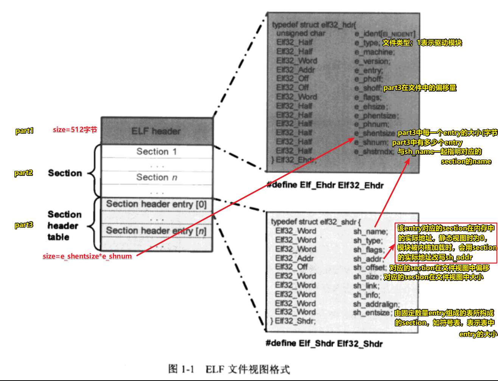

#### 1.2 EXPORT_SYMBOL的内核实现

​	对于静态编译链接而成的内核映像而言，所有的符号引用都将在静态链接阶段完成。

​	作为独立编译链接的内核模块，要解决这种静态链接无法完成的符号引用问题（在模块elf文件中，这种引用称为“未解决的引用”） 

​	处理"未解决引用"问题的本质是在模块加载期间找到当前“未解决的引用”符号在内存中的实际目标地址。

​	内核和内核模块通过符号表的形式向外部世界导出符号的相关信息。方式：EXPORT_SYMBOL,经三部分达成：EXPORT_SYMBOL宏定义部分，链接脚本连接器部分和使用到处符号部分。

​	在链接脚本告诉链接器把目标文件中名为`__ksymtab` 和`__ksymtab_strings`的section放置在最终内核（或内核模块）映像文件的名为 `__ksymtab`和`__ksymtab_strings`的section中， 然后用EXPORT_SYMBOL 来导处符号，实际上是要通过 struct kernel_symbol的一个对象告诉外部世界关于这个符号的符号名称(`__ksymtab_strings`中)和地址(`__ksymtab`中)，这个地址会在模块加载过程中由模块加载器负责修改该成员以反映出符号在内存中最终的目标地址，这个过程也就是"重定位"过程.

#### 1.3 模块的加载过程

##### 1.3.2 struct module

load_module返回值时struct module。是内核用来管理系统中加载模块时使用的，一个struct module对象代表着现实中一个内核模块在linux系统中的抽象。

重要成员：

```c
struct module{
    ...
    enum module_state; /*记录模块加载过程中不同阶段的状态*/
    struct list_head list;/*用来将模块链接到系统维护的内核模块链表中*/
    char name[MODULE_NAME_LEN];/*模块名称*/
    const struct kernel_symbol *syms;/*内核模块导出的符号所在起始地址*/
    const unsigned long *crcs;/*内核模块导出符号的校验码所在起始地址*/
    struct kernel_param *kp;/*内核模块参数所在的起始地址*/
    ini (*init)(void);/*指向内核模块初始化函数的指针，在内核模块源码中由module_init宏指定*/
    struct list_head source_list;
    struct list_head target_list; /*用来再内核模块间建立依赖关系*/
    ...
};
```

##### 1.3.3 load_module

- 模块ELF静态的内存视图

  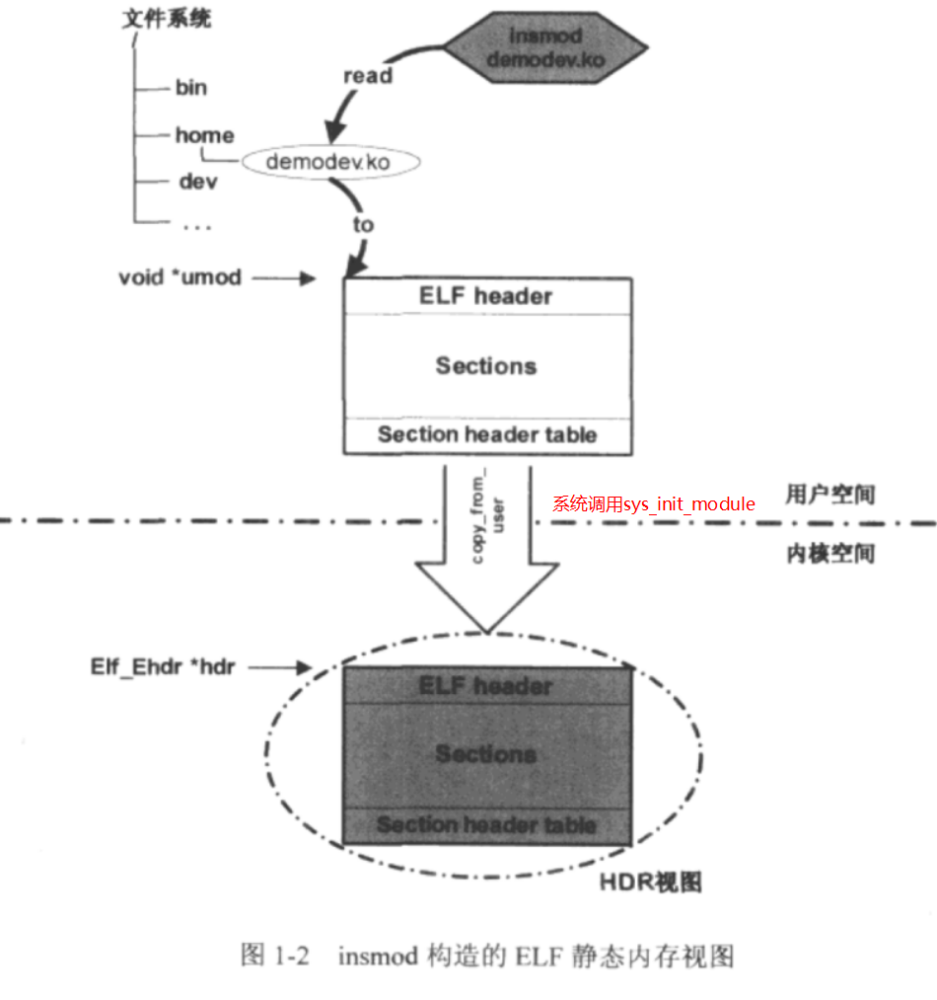

  - 字符串表（string table）

    在驱动模块所在ELF文件中，有两个字符串表section，一个用来保存各section名称的字符串，另一个用来保存符号表中每个符号名称的字符串。

    section名称字符串表的基地址：char *secstrings=(char *)hdr+entry[hdr->e_shstrndx]​.sh_offset. 其中e_shstrndx是段名称字符串表在段首部表中的索引. 想获得某一section的名称，通过索引i可得地址secstrings+entry[i].sh_name.

    符号名称字符串表的基地址：char *strtab=(char *)hdr+entry[entry[i].sh_link].sh_offset. 即首先遍历Section header table中所有的entry，找一个entry[i].sh_type=SHT_SYMTAB的entry，SHT_SYMTAB表明这个entry所对应的section是一符号表。这种情况下，entry[i].sh_link是符号名称字符串表section在Section header table中的索引值。

  - HDR视图的第一次改写

    获取到section名称字符串表基地址secstrings和符号名称字符串表基地址strtab后，函数开始遍历part3的所有entry，将sh_addr改为entry[i].sh_addr= (size_t)hdr+entry[i].offset。

  - find_sec函数

    寻找某一section在Section header table中的索引值

    static unsigned int find_sec(Elf_Ehdr *hdr, Elf_Shdr *sechdrs, const char *secstrings, const char *name);

    遍历Section header table中的entry,通过secstrings找到对应的section名称和name比较,相等后返回对应索引值。

    HDR视图第一次改后，然后查找此三个section(".gun,linkonce.this_module","__versions",".modinfo")对应的索引值赋给modindex,versindex,infoindex

  - struct module类型变量 mod初始化

    模块的构造工具为我们安插了一个".gun,linkonce.this_module" section，并初始化了其中一些成员如.init(即init_module别名(initfn)(即module_init(initfn)中的initfn),和.exit。在模块加载过程中load_module函数利用这个section中的数据来初始mod变量。次section在内存中的地址即为：mod=(void *)sechdrs[modindex].sh_addr。

  - HDR视图的第二次改写

    哪些section需要移动？移动到什么位置？layout_sections负责

    有标记SHF_ALLOC的section(分两大类CORE和INIT)

    - CORE section

    遍历Section header table，section name不是".init"开始的section划为CORE section。改对应entry的sh_sh_entsize,用来记录当前section在CORE section中的偏移量。

    entry[i].sh_entsize=mod->core_size;

    > sh_entsize:
    > 有些节的内容是一张表,其中每一个表项的大小是固定的,比如符号表;对于这种表来说,该字段指明这种表中的每一个表项的大小;如果该字段的值为0,则表示该节的内容不是这种表格;

    mod->core_size+=entry[i].sh_size;//记录当前正在操作的section为止，CORE section的空间大小

    code section用 module结构中的core_text_size来记录

    - INIT section

    section name 必须以".init"开始，内核用struct module结构中的init_size来记录当前INIT section空间大小

    mod->init_size+=entry[i].sh_size;

    code section 用module的init_text_size来记录

    

    CONFIG_KALLSYMS启用后会在内核模块中保留所有符号，在ELF符号表section中，由于没有SHF_ALLOC标志，layout_sections不会移动符号表section,所以用layout_symtab将其移动到CORE section中。

    之后内核用vmalloc为CORE section和INIT section分配对应内存空间，基地址分别在mod->module_core和mod->module_init中。接着就搬移CORE和INIT section到最终位置。之后更新其中各section对应table中entry的sh_addr.

    ".gun.linkonce.this_module" section带有SHF_ALLOC标志，也移到CORE section,所以要更新

    mod=(void *)entry[modindex].sh_addr;

    为什么要移动？

    模块加载过程结束时，系统会释放掉HDR视图所在的内存区域，模块初始化工作完成后，INIT section所在内存区域也会被释放，所以最终只会留下CORE section中的内容到整个模块存活期。

    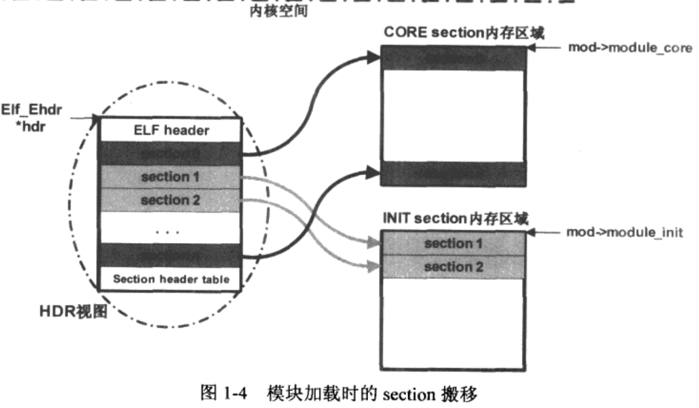

  - 模块导出符号

    内核模块会把导出符号放到_ksymtab、_ksymtab_gpl和_ksymtab_gpl_future section中。

    这些section都带SHF_ALLOC标志，在模块加载过程中会被搬移到CORE section区域去，

    在搬移CORE section和INIT section后，内核通过HDR视图中Section header table查找获取，keymtab,ksymtab_gpl和ksymtab_gpl_future section在CORE section中的地址，分别记录到mod->syms,mod->gpl_syms和mod->gpl_future_syms中，内核即刻通过这些变量得到模块导出的符号的所有信息。
    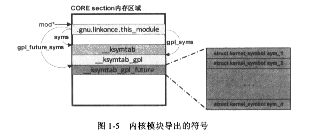

  - find_symbol函数

    用来查找一个符号

    struct symsearch用来对应要查找的每一个符号表section. enum型成员licence，NOT_GPL_ONLY由EXPORT_SYMBOL导出，GPL_ONLY由EXPORT_SYMBOL_GPL导出，WILL_BE_GPL_ONLY由EXPORT_SYMBOL_GPL_FUTURE导出。

    struct find_symbol_arg用做查找符号的标识参数，成员kernel_symbol是一个用以表示内核符号构成的数据结构。

    find_symbol函数首先构造被查找模块的标志参数fsa，然后通过each_symbol来查找符号。分两部分：第一部分：在内核导出的符号表中查找对应的符号，未找到，再进行第二部分：在系统中已加载模块(在全局变量modules的链表上)的导出符号中查找对应的符号。

    第一部分：在内核导出的符号表中查。查找时先构造 struct symsearch类型的数组arr。然后调用each_symbol_in_section查询内核的导出符号表，即遍历arr数组定义的各section，然后在每个section中依次通过find_symbol_in_section查找每个内核符号结构(kernel_symbol)

    find_symbol_in_section函数首先比较kernel_symbol结构体中的name与fsa中的name(正在查找的符号名，即要加载的内核模块中出现的"未解决的引用"的符号).不匹配返回false。fsa->gplok=true表明这是个GPL module,否则就是non-GPL module,对于后者，他不能使用内核导出的属于GPL_ONLY的那些符号，会直接返回查找失败。

    第二部分：在已加载模块导出的符号表中查。加载一个内核模块时需完成两点，第一，模块成功加载进系统之后，需将该模块的struc module类型变量mod加入到modules全局链表中去，记录所有已加载模块。第二，模块导出的符号信息记录在mod相关成员变量中。

    each_symbol用来再已加载模块导出的符号中查找指定符号。与在内核导出的符号表中查找符号的唯一区别在于 构造的arr数组：在全局链表modules中遍历所有已加载的内核模块，对其中每一模块用其导出符号表构造一个新的arr数组，然后查找特点符号。

  - 对"未解决的引用"符号的处理

    所谓"未解决的引用"符号，就是模块的编译工具链在对模块进行链接生成最终的.ko文件时，对于模块中调用的一些函数，如printk，无法在该模块的所有目标文件中找到这个函数的具体指令码。所以就将这个符号标记为"未解决的引用"。在内核模块被加载时，就是通过在内核或者其他模块导出的符号中找到这个"为解决就的引用"符号，从而找到该符号在内存中的地址，最终形成正确的函数调用。

    simplify_symbols函数实现此功能，用来为当前正在加载的模块中所有"未解决的引用"符号产生正确的目标地址。函数首先通过一个for循环遍历符号表中的所有符号，对于每个符号都会更具符号的st_shndx值分情况处理，通常情况下，该值表示符号所在section的索引值，称一般符号，它的st_value在ELF文件中的值时从section起始处算起的一个偏移。先得到符号所在section的最终内存地址，再加上它在section中的偏移量，就得到了符号最终内存地址。有些符号的st_shndx有特殊含义，SHN_ABS表明符号具有绝对地址，无需处理，SHN_UNDEF表明该符号是"undefined symbol即"未解决的引用",此时会调用resolve_symbol函数继而调用find_symbol函数去查找该符号，找到后把它在内存中的实际地址赋值给st_value。

  - 重定位
    重定位主要用来解决静态链接时的符号引用与动态加载时的实际符号地址不一致的问题。

    如果模块有EXPORT_SYMBOL导出的符号，那么模块的编译工具链会为这个模块的ELF文件生成一个独立的特殊section: ".rel__ksymtab",它专门用于对"__ksymtab" section的重定位，称为relocation section。

    重定位的section，在Section header table中的entry的sh_type值为SHT_REL或SHT_RELA.
    遍历Section header table的entry时发现sh_type=SHT_REL的section，就调用apply_relocate执行重定位，根据重定位元素的r_offset以及entry中的sh_info得到需要修改的导出符号struct kernel_symbol中的value所在的内存地址。然后根据r_info获得需要重定位的符号在符号表中的偏移量。也就是说 根据导出符号所在的section的relocation section，结合导出符号表section，修改导出符号的地址为在内存中最终的地址值，如此，内核模块导出符号的地址在系统执行重定位之后被更新为正确的值。

  - 模块参数

    内核模块在源码中必须用module_param宏声明模块可以接受的参数。

    ```c
    ...
    int dolpin;
    int bobcat;
    module_param(dolpin,int,0);
    module_param(bobcat,int,0);
    ...
    ```

    内核模块加载器对模块参数的初始化过程在模块初始化函数的调用之前。

    存在模块的"__param" section中，对应一个人relocation section".rel__param"，用来重定位。

    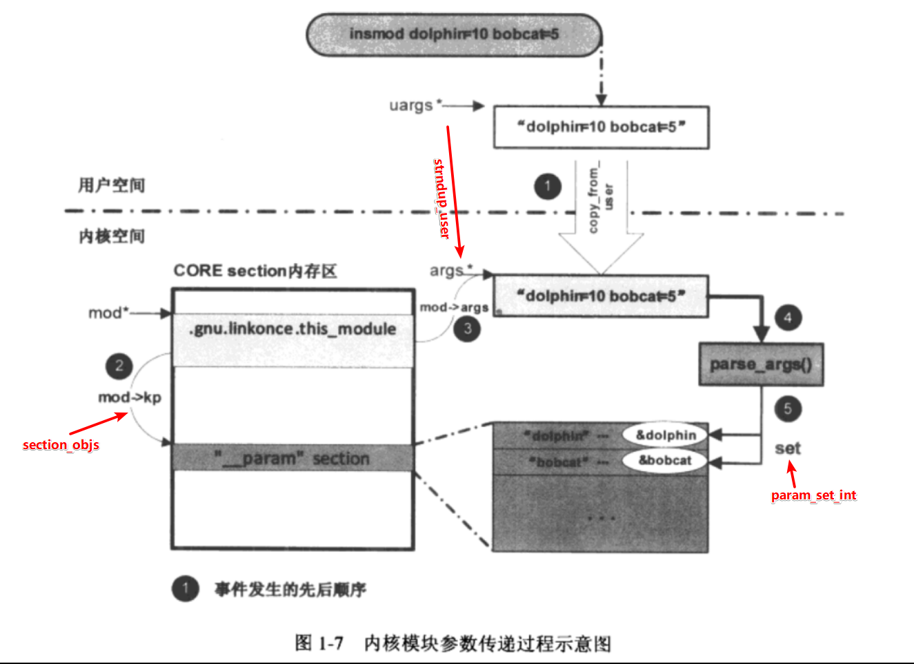

    在把命令行参数值复制到模块的参数这个过程中,module_param宏定义的"__param"section起了桥梁作用，通过"__param" section内核可以找到模块中定义的参数所在的内存地址，继而可以用命令行的值改写之。

  - 模块间的依赖关系

    当一个模块引用到另一个模块中导出的符号时，这两个模块间就建立了依赖关系，只存在于模块之间，模块与内核间不构成依赖关系。

    依赖关系的建立发生在当前模块对象mod被加载时，模块加载函数调用resolve_symbol函数来解决"未解决的引用"符号，如果成功的找到了指定的符号，就将那个模块记录在struct module *owner中，再调用ref_module(mod,owner)在mod和owner间建立依赖关系。

    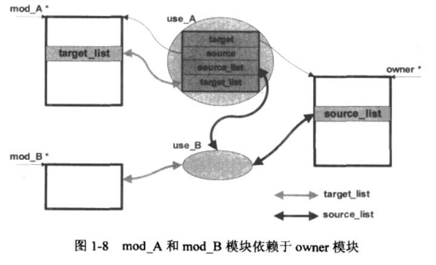

  - 模块的版本控制

    编译内核模块时，启用了CONFIG_MODEVERSIONS,则模块最终的ELF文件中会生成一个"__versions" section，会将模块中所有“未解决的引用”符号名和对应的校验码放入其间。

    接口验证时机是在resolve_symbol函数里调用check_version函数完成，遍历“__versions” section对每个struct modversion_info元素和找到的符号名symname进行批评，成功，再进行校验码比较，相同则表明接口一致

  - 模块的license

    在模块源码中以MODULE_LICENSE宏引出

    内核模块加载过程中，会调用license_is_gpl_compatible来确定license是否与GPL兼容。

##### 1.3.4 sys_init_module （第二部分）

  - 调用模块的初始化函数

    内核模块可以不提供模块初始化函数，如果提供了，将在do_one_initcall函数内部被调用。

  - 释放INIT section所占用的空间

    模块别加载成功，HDR视图和INIT section所占用的内存区域将不再会被用到，释放它，HDR视图释放实际上发生在load module函数的最后

- 呼叫模块通知链

  通知链（notifier call chain）module_notiy_list，通过通知链模块或者其他的内核组件可以向其感兴趣的一些内核时间进行注册，当该事件发生时，这些模块或组件注册的回调函数将会被调用。

#### 模块的卸载

​	rmmod通过系统调用sys_delete_module来完成卸载工作

- find_module函数

  sys_delete_module函数首先将来自用户工具欲卸载模块名用strncpy_from_user复制到内核空间，然后调用find_module在内核维护的模块链表modules中利用name来找要卸载的模块。

-  检查模块依赖关系

  检查是否有别的模块依赖于当前要卸载的模块，检查模块的source_list链表是否为空，判断依赖关系

- find_module函数

  sys_delete_module函数最后会调用free_module函数做清理工作，将卸载模块从modules链表中移除，将模块占用的CORE section空间释放，释放冲用户空间接受参数所占用的空间。


## 第二章 字符设备驱动程序

- linux系统设备驱动分三大类：字符设备、块设备、网路设备

- 字符设备在I/O传输过程中以字符为单位，传输速率慢（无缓存机制），如鼠标键盘打印机。

  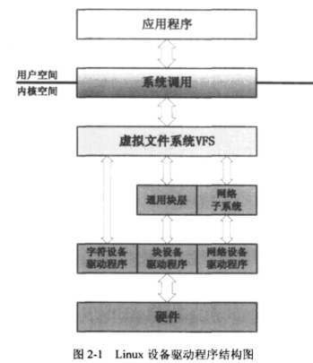

#### 目标
1. 构成字符设备驱动程序的内核设施的幕后机制。
2. 应用程序如何使用字符设备驱动程序提供的服务。

#### 2.1 应用程序与设备驱动程序互动实例

1. 编写编译字符设备驱动模块
   1. cdev_init(&chr_dev,&chr_ops);//初始化字符设备对象，和file_operations挂钩
   2. alloc_chrdev_region(&ndev,0,1,"chr_dev");//分配设备号
   3. cdev_add(&chr_dev,ndev,1);//将字符设备对象chr_dev注册进系统。
2. insmod加载内核模块到系统
3. mknod创建设备文件节点
4. 应用程序通过读写设备文件节点来调用设备驱动程序提供的服务。

#### 2.2 struct file_operations

- struct file_operations的成员变量几乎全是函数指针。

- owner成员，表示当前file_operations对象所属的内核模块,基本都赋值THIS_MODULE.

  #define THIS_MODULE （&__this_module）,__this_nodule是内核模块的编译工具链为当前模块产生的struct module类型对象，所以THIS_MODULE实际上是当前内核模块对象的指针。owner可以避免file_operations种的函数正在被调用时，其所属的模块从系统中卸载掉。

#### 2.3 字符设备的内核抽象

- 字符设备struct cdev

  ```c
  <include/linux/cdev.h>
  struct cdev {
      struct kobject kobj;//内嵌的内核对象
      struct module *owner;//字符设备驱动程序所在的内核模块对象指针
      const struct file_operations *ops;//应用程序通过文件系统接口呼叫到字符设备驱动程序种实现的文件操作类函数的过程种，ops指针起着桥梁纽带作用。
      struct list_head list;//用来将系统中的字符设备形成链表。
      dev_t dev;//字符设备的设备号，由主设备号和次设备号构成。
      unsigned int count;//隶属于同一主设备号的次设备号的个数，即当前设备驱动程序控制的实际同类设备的数量
  };
  ```

  两种方式产生struct cdev对象

  1. 静态定义

     static struct cdev chr_dev;

  2. 动态分配

     static struct cdev *p = kmalloc(sizeif(struct cdev),GFP_KERNEL);

- cdev_alloc
  专门用于动态分配struct cdev对象。分配对象，并且进行初始化。但通常cdev会作为内嵌成员出现在实际的设备数据结构中，如：

  ```c
  struct my_keypad_dev{
      int a;
      int b;
      struct cdev cdev;
  };
  ```

  此时动态分配就不能用cdev_alloc.而是：

  ​	static struct my_keypad_dev *p = kzalloc(sizeof(struct real_char_dev),GFP_KERNEL);

- cdev_init 

  初始化一个cdev对象

  ```c
  <fs/char_dev.c>
  void cdev_init(struct cdev *cdev,const struct file_operations *fops)
  {
      memset(cdev,0,sizeof *cdev);
      INIT_LIST_HEAD(&cdev->list);
      kobject_init(&cdev->kobj,&ktype_cdev_default);
      cdev->ops=fops;
  }
  ```

#### 2.4 设备号的构成与分配

  ##### 2.4.1 设备号的构成

  ​	Linux用dev_t类型变量来标识一个设备号，是一个32位的无符号整数。低20为表示次设备号，高12位表示主设备号，但不排除后续会改变，因此建议使用MAJOR、MINOR、MKDEV来操作设备号,只修改MINORBITS即可。

  ```c
  <include/linux/kdev_t.h>
  #define MAJOR(dev) ((unsigned int)((dev)>>MINORBITS))
  #define MINOR(dev) ((unsigned int)((dev) & MINORMASK))
  #define MKDEV(ma,mi) (((ma)<<MINORBITS)|(mi))
  ```

  ​	Linux内核用主设备号来定位对应的设备驱动程序，次设备号则由驱动程序使用，标识它所管理的若干同类设备。

  ##### 2.4.2 设备号的分配与管理

   - register_chardev_region函数

     int register_chrdev_region(dev_t from,unsigned count,const char *name);

     from表示一个设备号，count是连续设备编号的个数，name表示设备或驱动的名称。

     函数主要功能是将当前设备驱动程序要使用的设备号记录到chrdevs数组中。

     函数核心调用__register_chrdev_region函数

     ​	全局指针函数chrdevs,是内核用于设备号分配和管理的核心元素

     ```c
     <fs/char_dev.c>
     static struct char_device_struct{
     	struct char_device_stuct *next,
     	unsigned int major;
     	unsigned int baseminor;
     	int minorct;
     	char namep[64];
         struct cdev *cdev;
     } *chardevs[CHRDEV_MAJOR_HASH_SIZE];
     ```

     ​	函数首先分配一个struct char_device_struct类型对象cd，然后初始化，之后开始以哈希表的形式搜索chrdevs数组，获取散列关键值i=major%255,此后函数对chrdevs[i]元素管理的链表进行扫描，若chrdevs[i]上已经有了链表节点，表面之前有别的设备驱动程序使用的主设备号散列到了chrdevs[i]上。当前正在操作的设备号不与已经在使用的设备号发生冲突就可以将cd加入到chrdevs[i]领衔的链表中成为一个新的节点。

     ​	只有在主设备相同的情况下，次设备号范围和已经加入的设备号有重叠，才会冲突。

  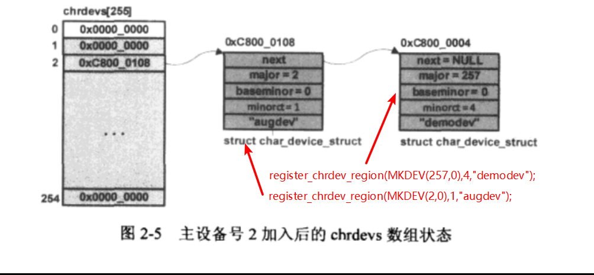

  - alloc_chrdev_region函数

    int alloc_chrdev_region(dev_t *dev,unsigned baseminor,unsigned count,const char *name);

    该函数由系统协助分配设备号，范围1~254

    核心调用也是__register_chrdev_region,第一个参数为0，会从chrdevs数组最后一项依次向前扫描，若某项chrdevs[i]为NULL就把该项对应索引值i作为分配的主设备号返回给驱动程序，同时生成一个char_device_struct节点，并加入到chrdevs[i]对应的哈希链表中。分配成功后通过*dev=MKDEV(cd->major,cd->baseminor)返回给函数调用者。

  - 释放设备号 void unregister_chrdev_region(dev_t from,unsigned count);

#### 2.5 字符设备注册

把一个字符设备加入到系统中使用cdev_add函数，核心功能通过kobj_map函数实现，其通过全局变量cdev_map来把设备（*p）加入到其中的哈希表中

```c
/* p为要加入系统的字符设备对象的指针
*  dev为该设备的设备号
*  count表示从次设备号开始连续的设备数量
*/ 
int cdev_add(struct cdev *p,dev_t dev,unsigned count)
{
    p-dev=dev;
    p->count=count;
    return kobj_map(cdev_map,dev,count,NULL,exaxt_match,exact_lock,p);
}
```

```c
<fs/char_dev.c>
static struct kobj_map *cdev_map; //系统启动期间由chrdev_init函数初始化

<driver/base/map.c>
struct kobj_map{
	struct probe{
		struct probe *next;
		dev_t dev;
		unsigned long range;
		struct module *owner;
		kobj_probe_t *get;
		int (*lock)(dev_t,void *);
		void *data;
	}*probes[255];
	struct mutex *lock;
}
```
kobj_map函数中哈希表的实现原理与前面注册分配设备号种的几乎完全一样，
设备驱动程序通过cdev_add把它所管理的设备对象指针嵌入到一个类型为struct probe的节点之中，然后再把该节点加入到cdev_map所实现的哈希链表中。
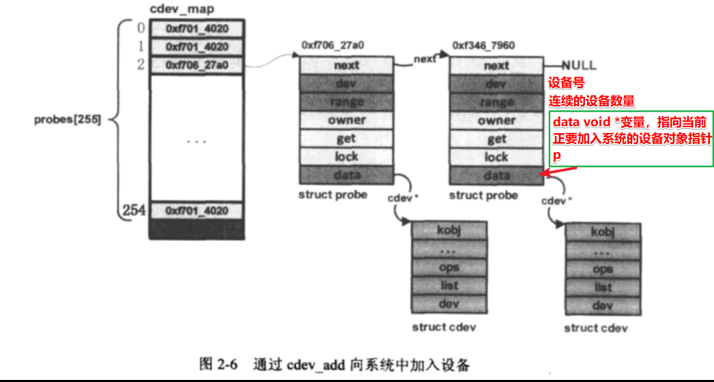

模块卸载函数应负责调用cdev_del(struct cdev *p)函数来将所管理的设备对象从系统中移除。  

#### 2.6 设备文件节点的生成

设备文件是沟通用户空间程序和内核空间驱动程序的桥梁。

当前的Linux内核在挂载完根文件系统之后，会在这个根文件系统的/dev目录上重新挂载一个新的文件系统devtmpfs,后者是个基于系统RAM的文件系统实现。

静态创建 mknod /dev/demodev c 2 0

​	mknod最终调用mknod函数，参数为设备文件名（“/dev/demodev”）和设备号（mkdev(30,0)）,通过系统调用sys_mknod进入内核空间。


#### 2.7 字符设备文件的打开操作

用户空间open函数原型 int open(const char *filename,int flags,mode_t mode); 返回int型的文件描述符fd

内核空间open函数原型int (*open)(struct inode *,struct file *); 驱动程序中的demodev_read,demodev_write,demodev_ioctl等函数第一个参数都是struct file *filp.

内核需要在打开设备文件时为fd和filp建立某种联系，其次是为filp与驱动程序中的fops建立关联。

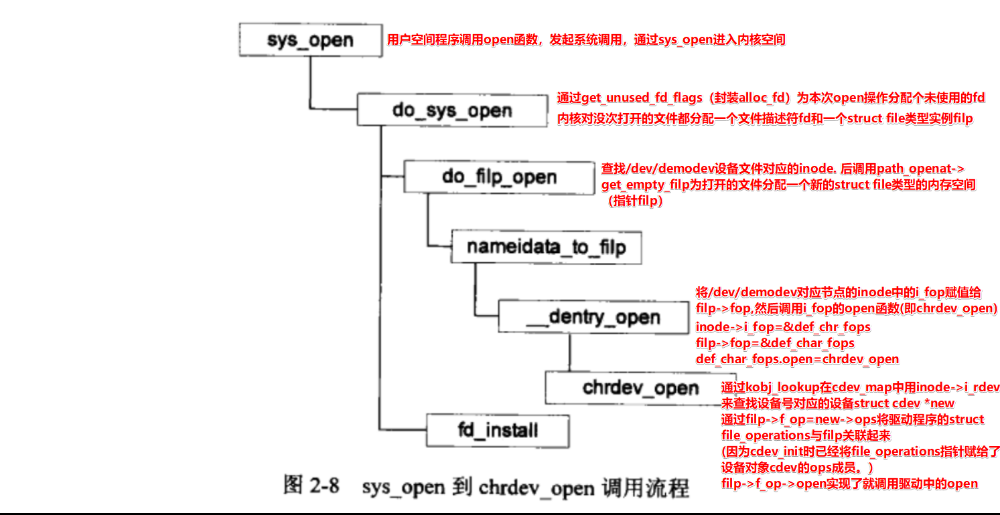

```c
<include/linux/fs.h>
struct file{
	...
	const struct file_operations *f_op;
	atomic_long_t f_count;//对struct file对象的使用计数，close文件时，只有f_count为0才真正执行关闭操作
	unsigned int f_flags;//记录当前文件被open时所指定的打开模式
	void *private_data;//记录设备驱动程序自身定义的数据，在某个特定文件视图的基础上共享数据?
	...
}
```

进程为文件操作维护一个文件描述符表（current->files->fdt），对设备文件的打开操作返回的文件描述符fd,作为进程维护的文件描述符表（指向struct file *类型数组）的索引值，将之前新分配的struct file空间地址赋值给它：

current->files->fdt->pfd[fd]=filp;

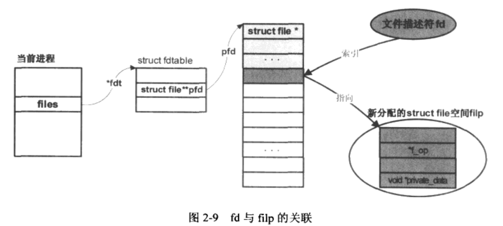

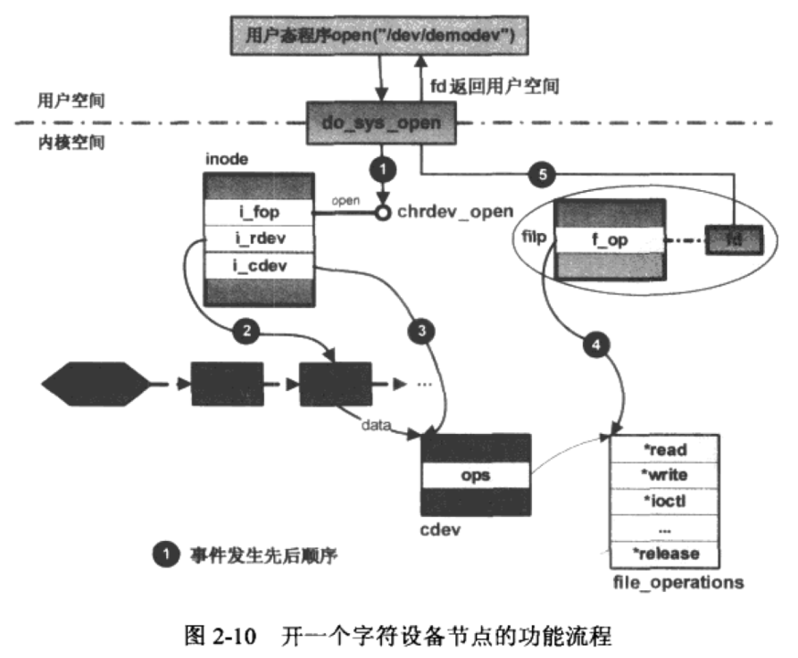

用户空间close函数 int close(unsigned int fd);从fd得到filp，然后调用int filp_close(struct file *filp,fl_owner_t id)

​	flush函数，若设备驱动定义就调用，函数为了确保在把文件关闭前缓存在系统中的数据被真正的写回到硬件，字符设备很少有定义，多用在块设备上，比如SCSI硬盘和系统进行大数据传输，为此内核设计了高速缓存机制，在文件关闭前将高速缓存数据写回到磁盘中

​	relase函数，只有在当前文件的所有副本都关闭后，relase函数才会被调用。

